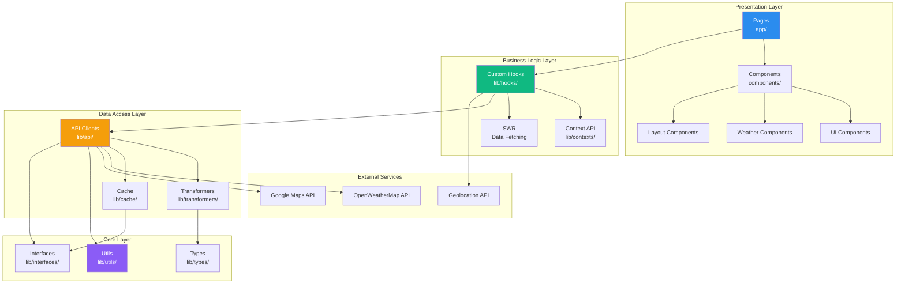
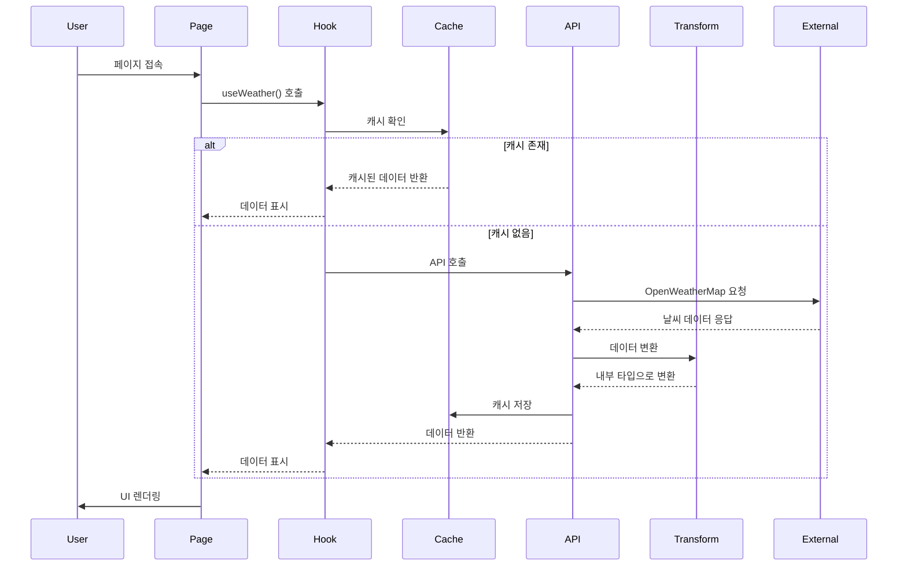

# ☀️ Weather Forecaster

> 현대적인 웹 기술과 소프트웨어 공학 원칙을 적용한 날씨 예보 웹 애플리케이션

[](https://tlstn3172.github.io/weather-forecaster-demo)
[](https://www.typescriptlang.org/)
[](https://nextjs.org/)
[](https://github.com/tlstn3172/weather-forecaster-demo)
[](https://github.com/tlstn3172/weather-forecaster-demo)

## 📌 프로젝트 소개

Weather Forecaster는 **현재 위치 또는 특정 도시의 날씨 정보**를 직관적이고 아름다운 인터페이스로 제공하는 모바일 우선 웹 애플리케이션입니다. 단순한 날씨 앱을 넘어, **소프트웨어 공학의 모범 사례**를 실제로 적용한 포트폴리오 프로젝트입니다.

### 🎯 프로젝트의 차별점

#### 1. **엄격한 소프트웨어 공학 원칙 적용**
- ✅ **TDD (Test-Driven Development)**: 모든 코어 로직을 테스트 우선 개발
- ✅ **SOLID 원칙**: 유지보수 가능하고 확장 가능한 아키텍처
- ✅ **Clean Architecture**: 계층 분리를 통한 의존성 관리
- ✅ **타입 안정성**: TypeScript로 런타임 에러 최소화

#### 2. **프로덕션 레벨의 개발 프로세스**
- 📋 체계적인 문서화 (PRD, TechSpec, Tasks)
- 🔄 GitHub Actions를 통한 CI/CD 자동화
- 📊 테스트 커버리지 90% 이상 유지
- 🎨 디자인 시스템 기반 UI 개발

#### 3. **현대적인 기술 스택**
- ⚡ Next.js 14 (App Router, Static Export)
- 🎨 Tailwind CSS (커스텀 디자인 시스템)
- 🧪 Jest + MSW (API 모킹)
- 🗺️ Google Maps API 통합

## 🏗️ 아키텍처

### 시스템 아키텍처



### 데이터 흐름



### 폴더 구조

```
weather-forecaster-demo/
├── app/                      # Next.js App Router
│   ├── layout.tsx           # 루트 레이아웃
│   ├── page.tsx             # 메인 페이지
│   ├── cities/              # 도시 관리 페이지
│   ├── radar/               # 레이더 지도 페이지
│   ├── profile/             # 설정 페이지
│   └── api/                 # API Routes (프록시)
│
├── components/              # React 컴포넌트
│   ├── ui/                  # 재사용 가능한 UI
│   ├── weather/             # 날씨 관련 컴포넌트
│   ├── layout/              # 레이아웃 컴포넌트
│   └── map/                 # 지도 컴포넌트
│
├── lib/                     # 비즈니스 로직
│   ├── api/                 # API 클라이언트 (TDD)
│   ├── hooks/               # 커스텀 훅 (TDD)
│   ├── utils/               # 유틸리티 함수 (TDD)
│   ├── types/               # TypeScript 타입
│   ├── interfaces/          # 인터페이스 (SOLID-DIP)
│   ├── cache/               # 캐싱 레이어 (SOLID-OCP)
│   ├── transformers/        # 데이터 변환 (TDD)
│   └── contexts/            # React Context
│
├── __tests__/               # 테스트 파일
│   └── unit/                # 단위 테스트 (90%+ 커버리지)
│
├── docs/                    # 프로젝트 문서
│   ├── PRD.md              # 제품 요구사항 문서
│   ├── TechSpec.md         # 기술 명세서
│   ├── TASKS.md            # 작업 분해 구조
│   └── design/             # 디자인 파일
│
└── rules/                   # 개발 규칙
    ├── tdd.md              # TDD 가이드라인
    └── solid.md            # SOLID 원칙 가이드
```

## 🎨 주요 기능

### 1. 실시간 날씨 정보
- 📍 현재 위치 기반 자동 날씨 표시
- 🌡️ 현재 온도, 체감 온도, 최고/최저 기온
- ☀️ 날씨 상태 및 아이콘 표시

### 2. 상세 예보
- ⏰ **시간별 예보**: 향후 24시간 날씨
- 📅 **10일 예보**: 장기 날씨 트렌드
- 📊 온도 범위 시각화 (그라데이션 바)

### 3. 상세 기상 정보
- ☀️ **UV 지수**: 자외선 강도 및 권장사항
- 💧 **습도**: 현재 습도 및 이슬점
- 💨 **바람**: 풍속, 풍향 (나침반 시각화)
- 👁️ **가시거리**: 시야 거리 정보

### 4. 도시 관리
- 🔍 도시 검색 및 추가
- 💾 관심 도시 저장 (localStorage)
- 🔄 도시 간 빠른 전환

### 5. 강수량 지도
- 🗺️ Google Maps 기반 지도
- 🌧️ 강수량 레이어 오버레이
- 🌙 다크 테마 지도 스타일

## 🛠️ 기술 스택

### Frontend
- **Framework**: Next.js 14 (App Router, Static Export)
- **Language**: TypeScript 5.0
- **Styling**: Tailwind CSS 3.4
- **State Management**: React Context API + SWR
- **Icons**: Material Symbols

### Testing
- **Unit Testing**: Jest 29 + ts-jest
- **API Mocking**: MSW 2.0
- **Coverage**: 90%+ (코어 로직)

### External APIs
- **Weather Data**: OpenWeatherMap API
- **Maps**: Google Maps JavaScript API
- **Geolocation**: Browser Geolocation API

### DevOps
- **CI/CD**: GitHub Actions
- **Deployment**: GitHub Pages
- **Version Control**: Git + GitHub

## 🚀 시작하기

### 사전 요구사항
- Node.js 18.x 이상
- npm 또는 yarn
- OpenWeatherMap API 키
- Google Maps API 키

### 설치

```bash
# 저장소 클론
git clone https://github.com/tlstn3172/weather-forecaster-demo.git
cd weather-forecaster-demo

# 의존성 설치
npm install

# 환경 변수 설정
cp .env.local.example .env.local
# .env.local 파일을 열어 API 키 입력
```

### 환경 변수 설정

`.env.local` 파일에 다음 내용을 추가하세요:

```env
NEXT_PUBLIC_OPENWEATHER_API_KEY=your_openweathermap_api_key
NEXT_PUBLIC_GOOGLE_MAPS_API_KEY=your_google_maps_api_key
```

**API 키 발급 방법:**
- [OpenWeatherMap](https://openweathermap.org/api): 무료 플랜 사용 가능
- [Google Maps](https://developers.google.com/maps/documentation/javascript/get-api-key): Maps JavaScript API 활성화

### 개발 서버 실행

```bash
# 개발 모드
npm run dev

# 브라우저에서 http://localhost:3000 접속
```

### 테스트 실행

```bash
# 모든 테스트 실행
npm run test

# 커버리지 포함
npm run test -- --coverage

# Watch 모드
npm run test -- --watch
```

### 프로덕션 빌드

```bash
# 빌드
npm run build

# 빌드 결과물은 out/ 폴더에 생성됨
```

## 📊 개발 프로세스

### 1. 문서 우선 접근
모든 개발은 명확한 문서화에서 시작합니다:
- **PRD**: 제품 요구사항 정의
- **TechSpec**: 기술적 의사결정 문서화
- **TASKS**: 작업을 실행 가능한 단위로 분해

### 2. TDD (Test-Driven Development)
코어 로직은 반드시 테스트를 먼저 작성합니다:
```
Red (실패하는 테스트) → Green (통과하는 코드) → Refactor (리팩토링)
```

**테스트 커버리지:**
- 유틸리티 함수: 100%
- API 클라이언트: 85%+
- 전체 코어 로직: 90%+

### 3. SOLID 원칙 준수
- **SRP**: 각 모듈은 하나의 책임만
- **OCP**: 확장에는 열려있고 수정에는 닫혀있게
- **LSP**: 하위 타입은 상위 타입을 대체 가능
- **ISP**: 인터페이스를 작은 단위로 분리
- **DIP**: 추상화에 의존, 구체화에 의존하지 않음

### 4. CI/CD 파이프라인


## 🎓 학습 포인트

이 프로젝트를 통해 다음을 학습하고 적용했습니다:

### 소프트웨어 공학
- ✅ TDD를 통한 안정적인 코드 작성
- ✅ SOLID 원칙을 실제 프로젝트에 적용
- ✅ Clean Architecture 패턴 이해
- ✅ 의존성 주입 (Dependency Injection)

### 웹 개발
- ✅ Next.js 14 App Router 활용
- ✅ TypeScript로 타입 안정성 확보
- ✅ SWR을 통한 효율적인 데이터 페칭
- ✅ 반응형 디자인 구현

### DevOps
- ✅ GitHub Actions CI/CD 구축
- ✅ 자동화된 테스트 및 배포
- ✅ 환경 변수 관리
- ✅ Static Site Generation

### API 통합
- ✅ RESTful API 클라이언트 구현
- ✅ API 응답 데이터 변환
- ✅ 에러 핸들링 및 재시도 로직
- ✅ 캐싱 전략 구현

## 📈 성능 최적화

- ⚡ **코드 스플리팅**: 동적 임포트로 초기 로딩 시간 단축
- 🎨 **이미지 최적화**: next/image 활용
- 💾 **캐싱**: localStorage + SWR로 불필요한 API 호출 최소화
- 🔄 **메모이제이션**: React.memo, useMemo, useCallback 적용

## 🌐 배포

이 프로젝트는 GitHub Pages에 자동 배포됩니다:
- **Live Demo**: https://tlstn3172.github.io/weather-forecaster-demo
- **배포 방식**: GitHub Actions (자동)
- **배포 트리거**: main 브랜치 push

## 📝 라이선스

이 프로젝트는 MIT 라이선스 하에 있습니다.

## 👤 개발자

**tlstn3172**
- GitHub: [@tlstn3172](https://github.com/tlstn3172)
- Portfolio: [Weather Forecaster Demo](https://tlstn3172.github.io/weather-forecaster-demo)

---

## 🎯 포트폴리오 하이라이트

### 왜 이 프로젝트가 특별한가?

#### 1. **실무 수준의 개발 프로세스**
단순히 기능을 구현하는 것을 넘어, 실제 기업에서 사용하는 개발 프로세스를 적용했습니다:
- 요구사항 분석 → 기술 설계 → 작업 분해 → TDD 구현 → CI/CD 배포

#### 2. **높은 코드 품질**
- 90% 이상의 테스트 커버리지
- TypeScript로 타입 안정성 확보
- SOLID 원칙 준수로 유지보수성 향상
- ESLint + Prettier로 일관된 코드 스타일

#### 3. **확장 가능한 아키텍처**
- 계층 분리를 통한 관심사 분리
- 인터페이스 기반 설계로 쉬운 확장
- 의존성 역전으로 테스트 용이성 확보

#### 4. **프로덕션 레디**
- 자동화된 CI/CD 파이프라인
- 성능 최적화 적용
- 웹 접근성 고려
- SEO 최적화

이 프로젝트는 **"코드를 작성할 수 있다"**를 넘어 **"소프트웨어를 설계하고 구축할 수 있다"**를 보여주는 포트폴리오입니다.

---

<div align="center">

**⭐ 이 프로젝트가 도움이 되었다면 Star를 눌러주세요!**

Made with ❤️ by tlstn3172

</div>
